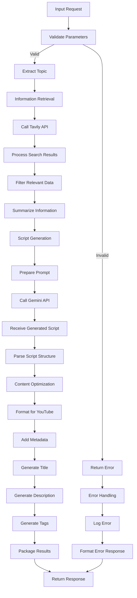
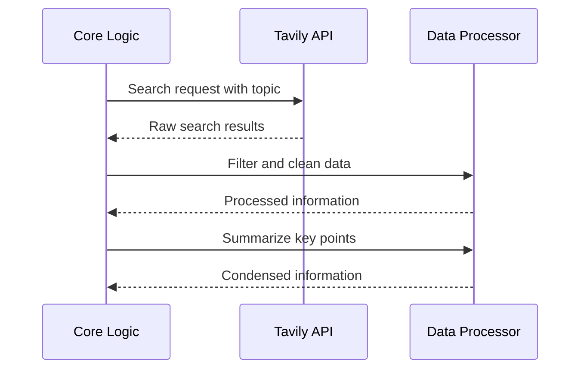
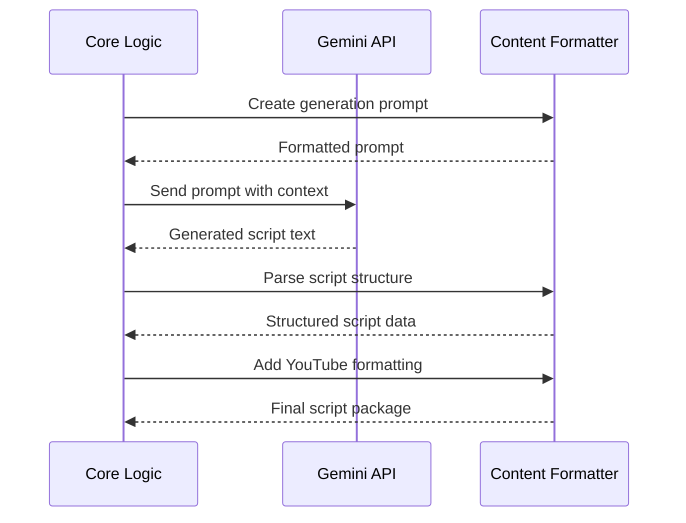
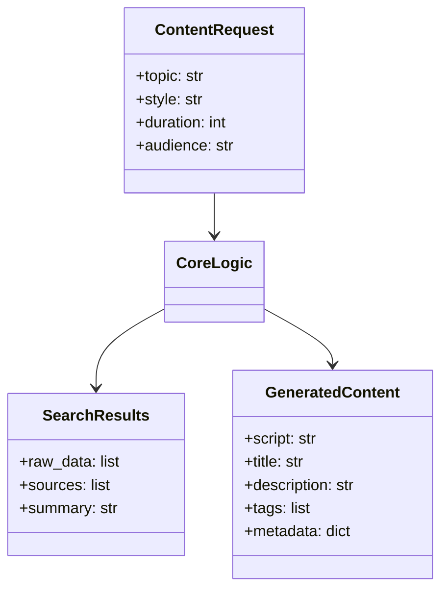
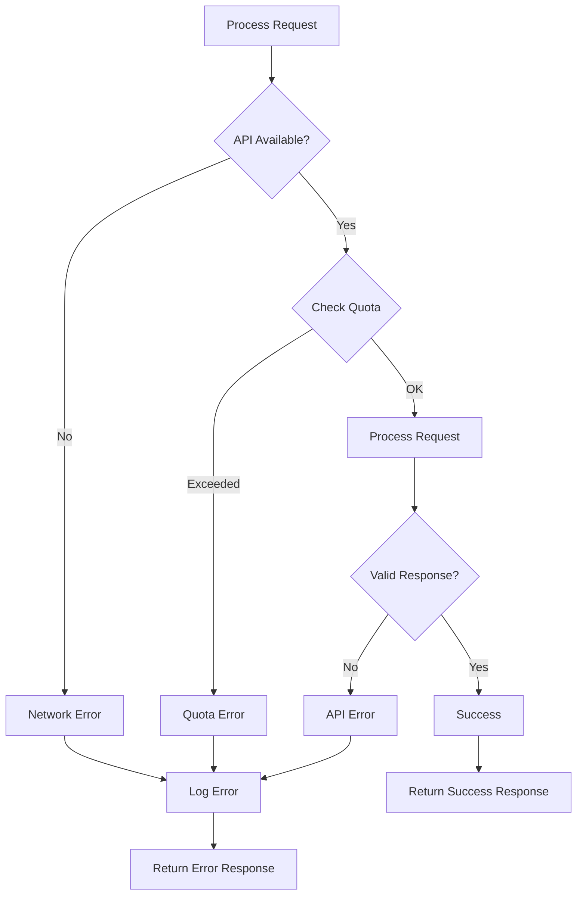
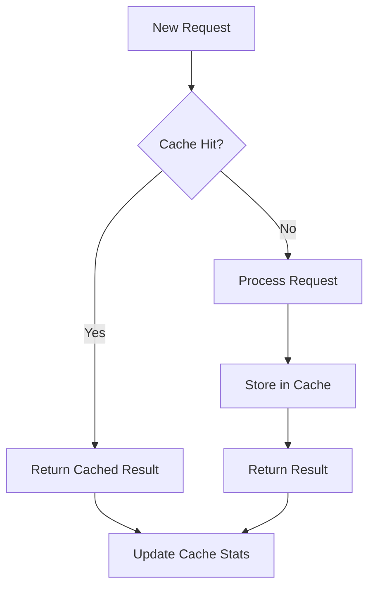
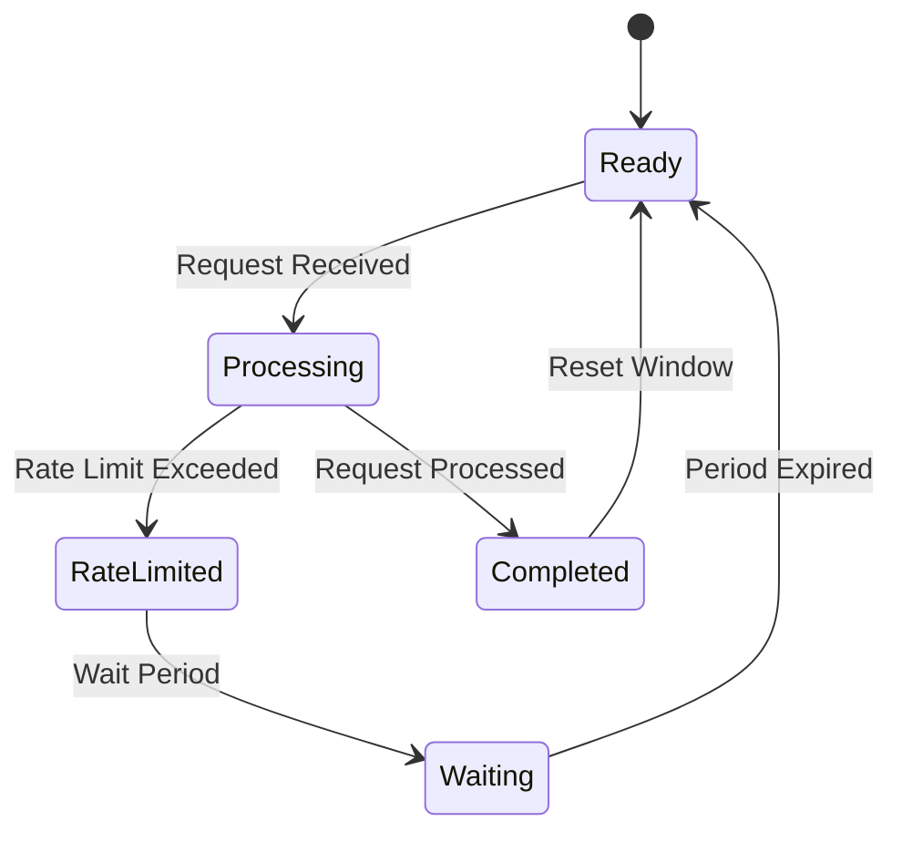

# Core Logic Workflow

## Core Processing Sequence

### Information Retrieval Process

### Script Generation Process

## Core Components

### Data Structures

### Error Handling

## Performance Considerations

### Caching Strategy

### Rate Limiting
