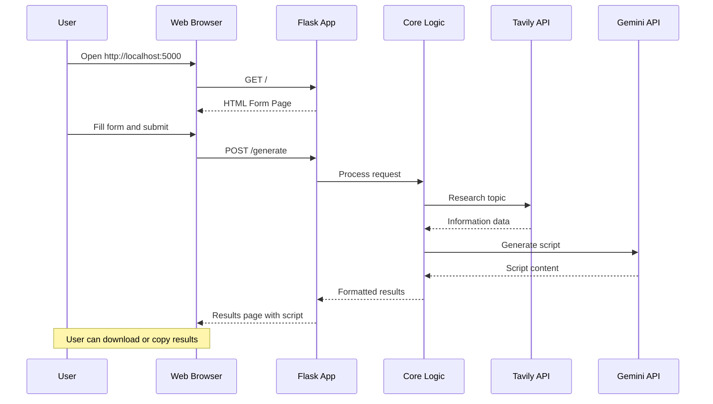
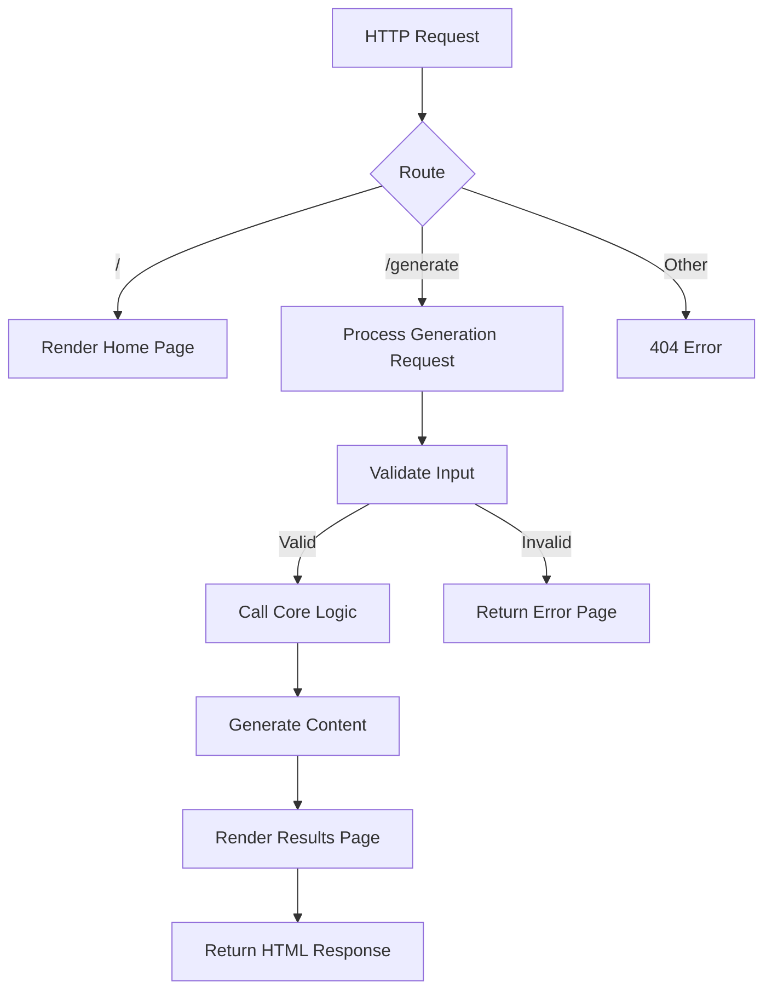
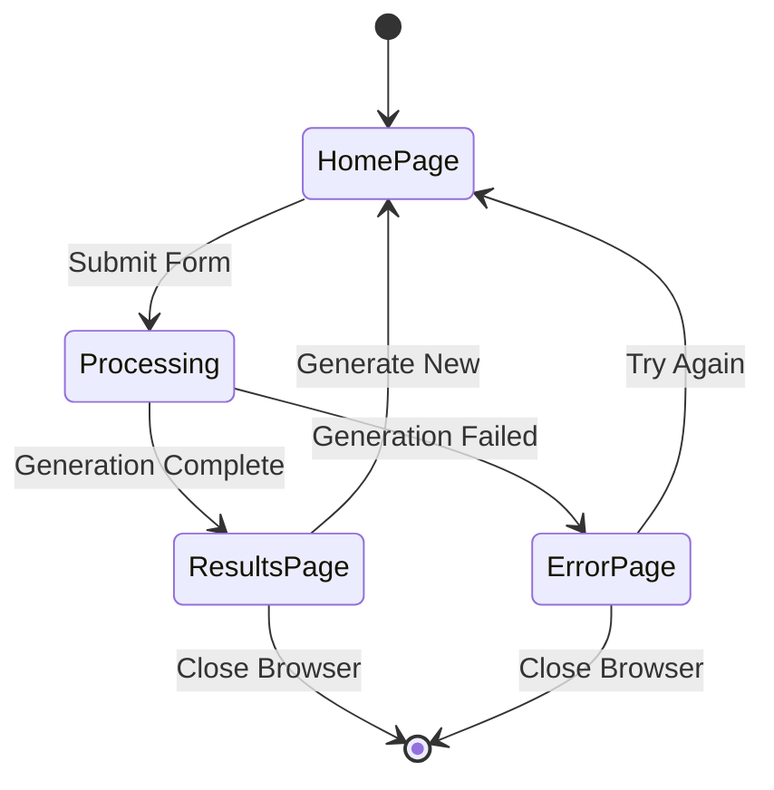

# Flask Web Application Workflow

## Flask Application Flow

### Request Processing

### Page Flow

## Flask Components

### Routes
- `GET /`: Home page with input form
- `POST /generate`: Process content generation
- `GET /health`: Health check endpoint

### Templates
- `index.html`: Main form page
- `results.html`: Results display page
- `error.html`: Error display page

### Static Files
- CSS for styling
- JavaScript for interactivity
- Images and assets