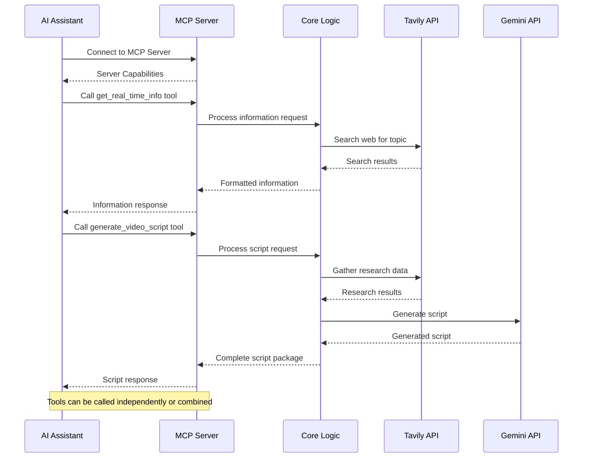
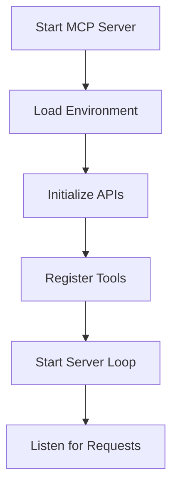
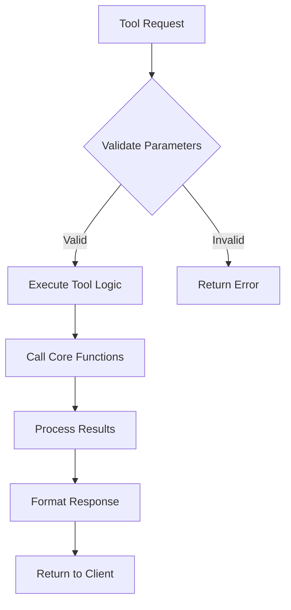

# MCP Server Workflow

```mermaid
sequenceDiagram
    participant Client as AI Assistant
    participant MCP as MCP Server
    participant Core as Core Logic
    participant Tavily as Tavily API
    participant Gemini as Gemini API

    Client->>MCP: Connect to MCP Server
    MCP-->>Client: Server Capabilities

    Client->>MCP: Call get_real_time_info tool
    MCP->>Core: Process information request
    Core->>Tavily: Search web for topic
    Tavily-->>Core: Search results
    Core-->>MCP: Formatted information
    MCP-->>Client: Information response

    Client->>MCP: Call generate_video_script tool
    MCP->>Core: Process script request
    Core->>Tavily: Gather research data
    Tavily-->>Core: Research results
    Core->>Gemini: Generate script
    Gemini-->>Core: Generated script
    Core-->>MCP: Complete script package
    MCP-->>Client: Script response

    Note over Client,MCP: Tools can be called independently or combined
```

## MCP Server Components

### Server Initialization

```mermaid
flowchart TD
    A[Start MCP Server] --> B[Load Environment]
    B --> C[Initialize APIs]
    C --> D[Register Tools]
    D --> E[Start Server Loop]
    E --> F[Listen for Requests]
```

### Tool Processing Flow

```mermaid
flowchart TD
    A[Tool Request] --> B{Validate Parameters}
    B -->|Valid| C[Execute Tool Logic]
    B -->|Invalid| D[Return Error]
    C --> E[Call Core Functions]
    E --> F[Process Results]
    F --> G[Format Response]
    G --> H[Return to Client]
```