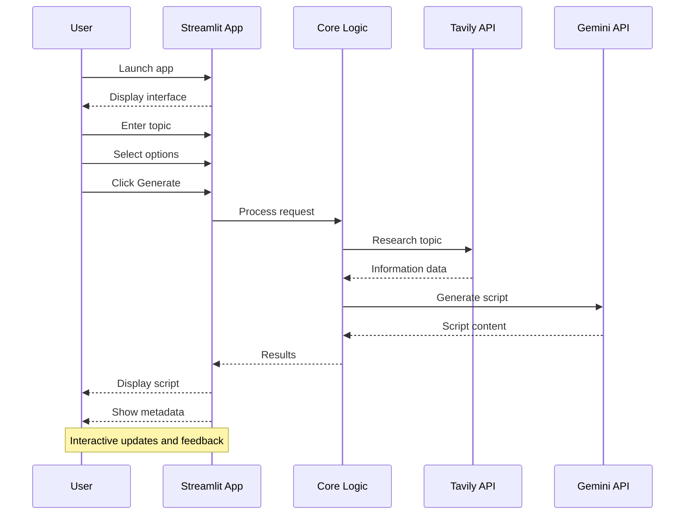
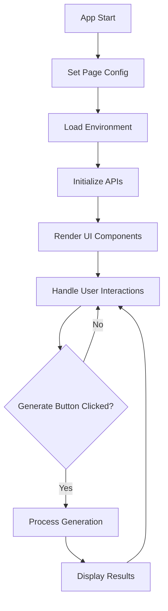
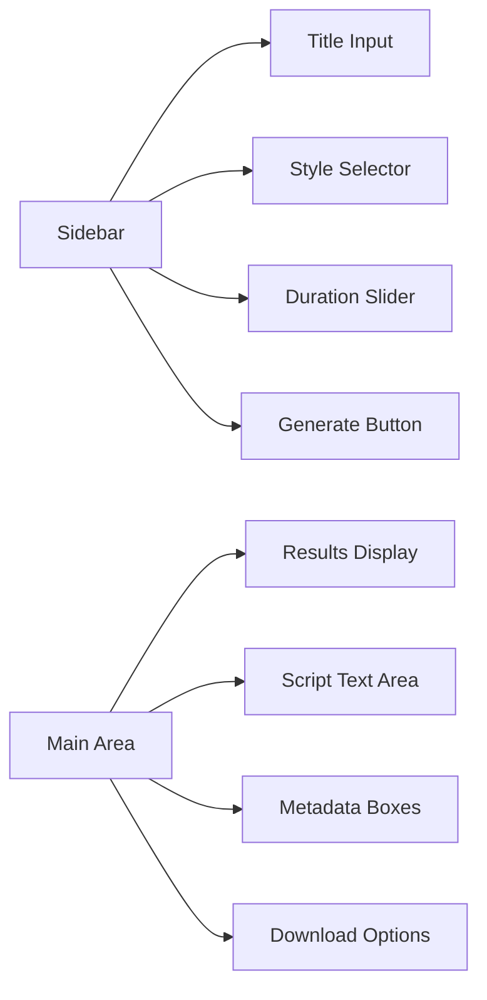
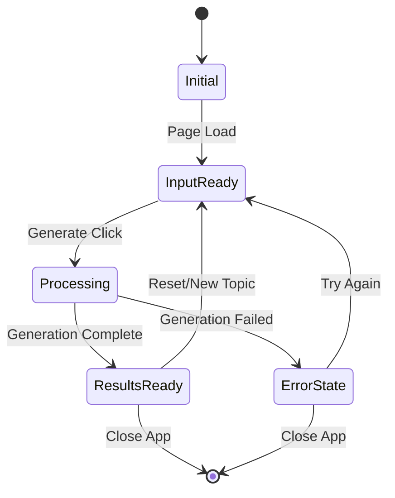
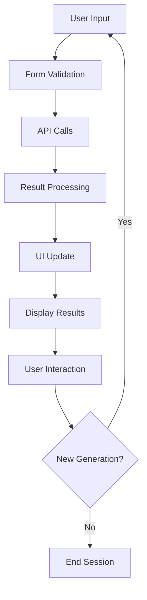

# Streamlit Demo Workflow

## Streamlit Interface Flow

### App Structure

### UI Components

## Streamlit Features

### Interactive Elements
- **Text Input**: Topic entry with validation
- **Radio Buttons**: Style selection
- **Slider**: Duration adjustment
- **Button**: Generation trigger
- **Text Area**: Script display (read-only)
- **Info Boxes**: Metadata display
- **Download Button**: Export functionality

### State Management

### Data Flow
