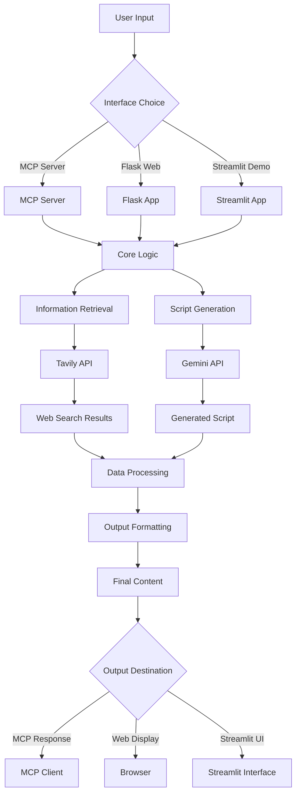

# System Architecture Workflow

## Workflow Description

1. **User Input**: User provides topic and parameters through chosen interface
2. **Interface Selection**: Choose between MCP server, Flask web app, or Streamlit demo
3. **Core Processing**: All interfaces route to the core application logic
4. **Information Retrieval**: Use Tavily API to gather real-time web data
5. **Script Generation**: Use Gemini API to create video scripts
6. **Data Processing**: Combine and process retrieved information and generated content
7. **Output Formatting**: Format final content for the target platform
8. **Delivery**: Return results through the appropriate interface