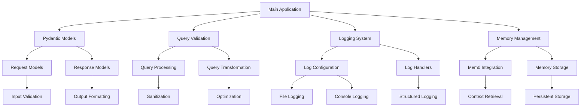
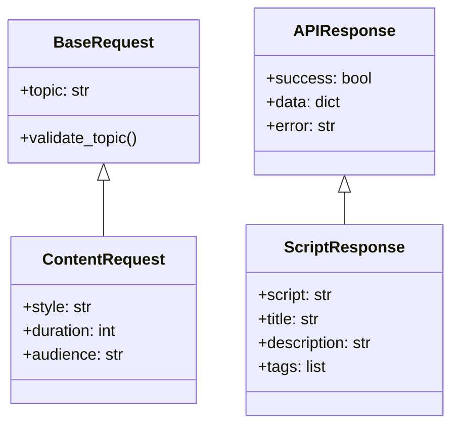
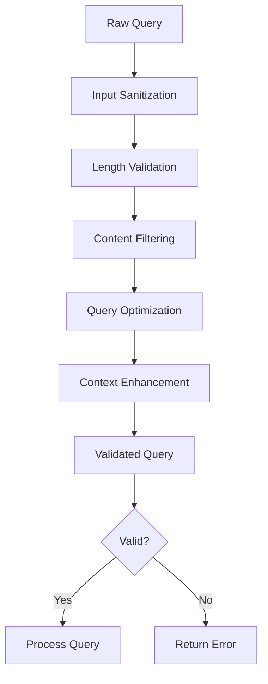
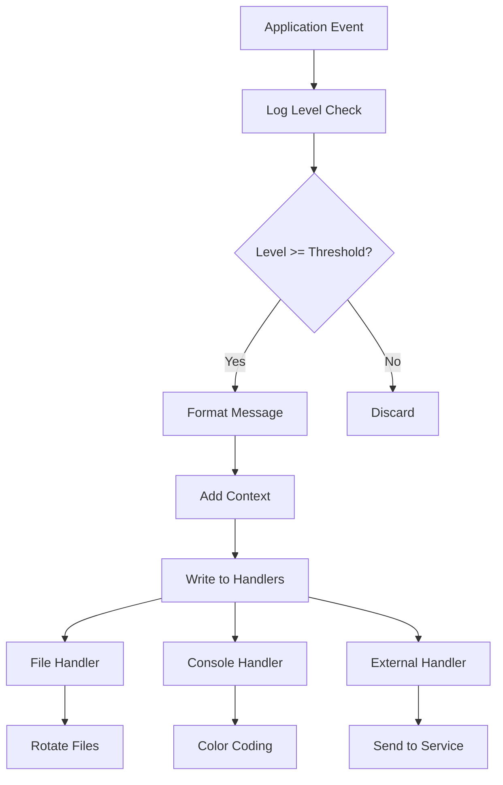
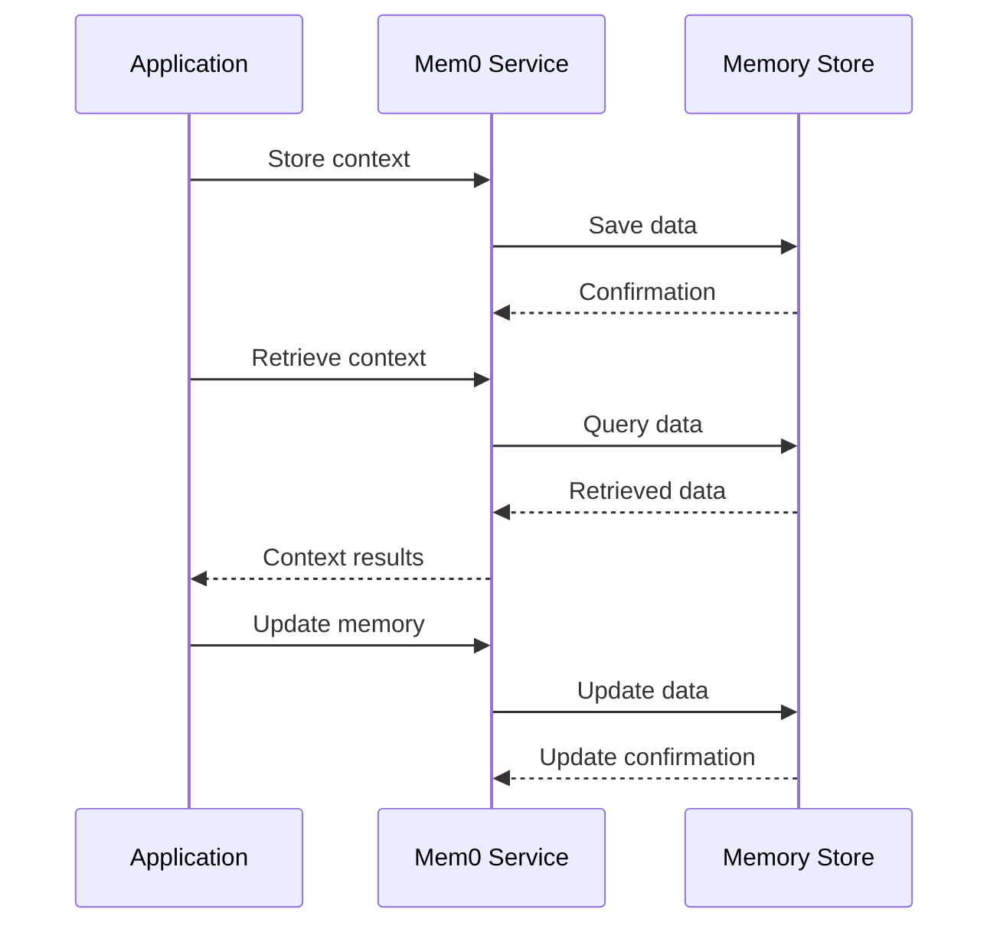
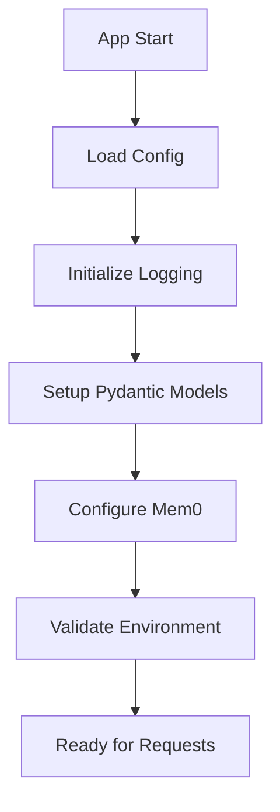
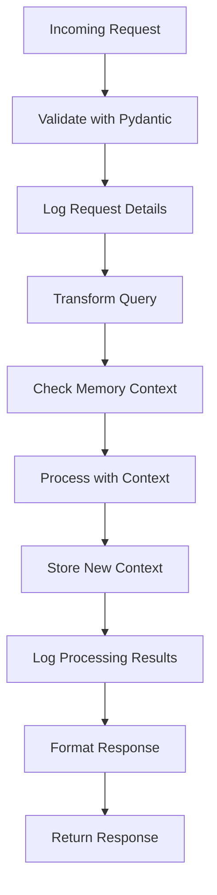
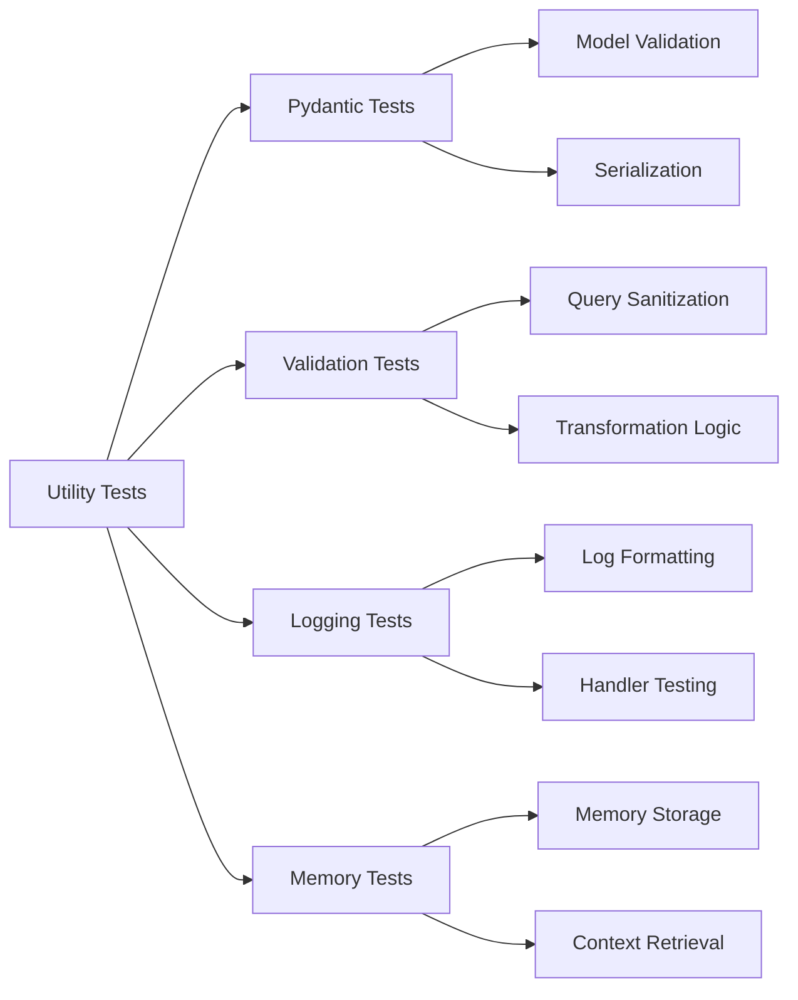

# Utilities Workflow



## Utility Modules Overview

### Pydantic Models


### Query Validation & Transformation


### Logging System


### Memory Management (Mem0)


## Utility Integration Flow

### Application Startup


### Request Processing with Utilities


## Configuration and Setup

### Logging Configuration
```yaml
logging:
  level: INFO
  format: "%(asctime)s - %(name)s - %(levelname)s - %(message)s"
  handlers:
    - file:
        filename: app.log
        maxBytes: 10485760
        backupCount: 5
    - console:
        level: DEBUG
```

### Mem0 Configuration
```python
mem0_config = {
    "vector_store": {
        "provider": "chroma",
        "config": {
            "collection_name": "youtube_agent_memory",
            "path": "./db"
        }
    },
    "llm": {
        "provider": "openai",  # or other providers
        "config": {
            "model": "gpt-4",
            "temperature": 0.1
        }
    }
}
```

## Testing Utilities

### Unit Test Coverage


## Performance Monitoring

### Metrics Collection
- Request validation time
- Query transformation duration
- Memory retrieval latency
- Log processing overhead
- Error rates by utility

### Health Checks
- Pydantic model loading
- Logging system availability
- Memory store connectivity
- Configuration validation